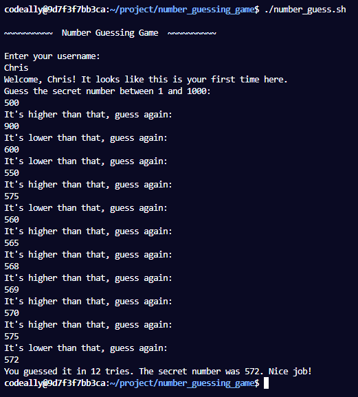
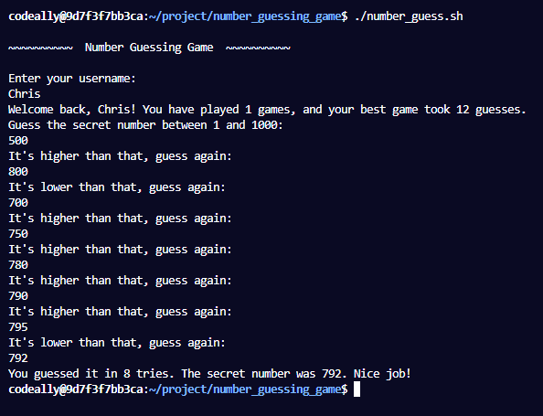
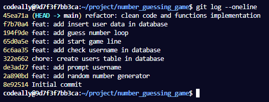

# FCC - Number Guessing Game

## Description

This is a interactive bash programm `( number_guess.sh )` that generate a random number between `1` and `100`. The user is prompt to take a guess until the secret number is found. User informations such as `username`, `game played` and `best game guess number` are stored into the database.

This project is part of the **[freeCodeCamp](https://www.freecodecamp.org/learn/relational-database/build-a-number-guessing-game-project/build-a-number-guessing-game)** Relation Database projects certification.

## Example outputs

### Example 1

    

### Example 2

    

### Git log

    

